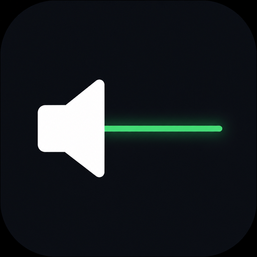
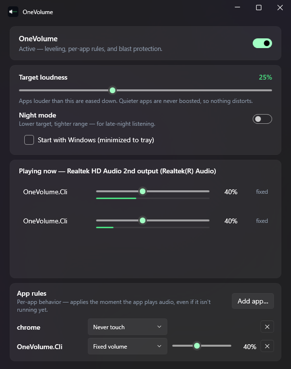

<div align="center">



# OneVolume

**One volume for everything.**
Automatic per-app loudness leveling **and a full per-app volume control center** for
Windows — dialogue stays audible, ads never blast you, and you stop riding the volume keys.

[](https://github.com/pwnapplehat/OneVolume/actions)
[](LICENSE)
[](https://dotnet.microsoft.com/)

Free · open source · no ads · no telemetry · no drivers · no admin



</div>

---

## The problem

Every app plays at its own loudness. A quiet movie, then a screaming ad. A whisper-level
podcast, then a Discord ping that takes a year off your life. Windows' own fix — "Loudness
Equalization" — is buried in a 2006-era dialog, works per *device*, and simply doesn't exist
on many modern USB-DAC and Bluetooth drivers. Per-app mixers (including the excellent
EarTrumpet) still make **you** do the adjusting.

## What OneVolume does

OneVolume watches every app's audio session and gently steers each one toward a single
target loudness that you choose:

- **Attenuation-only** — apps that are too loud are eased down; quiet apps are *never*
  boosted past 100%, so nothing ever distorts or clips.
- **Blast protection** — a sudden scream (that 2 AM ad) is clamped within a fraction of a
  second, much faster than the normal gentle ramp.
- **Deadband + hysteresis** — inside your tolerance nothing is touched, so volumes never
  "seasick" up and down; once correcting, it settles cleanly at the target.
- **Silence gating** — apps that aren't playing are ignored (silence never causes a
  volume change that would blast you later).
- **You always win** — move any app's slider in the Windows volume mixer (or OneVolume's
  own) and that session is pinned immediately: your explicit choice overrides the
  algorithm until the app closes or you toggle leveling. It never fights you.
- **Live per-app mixer** — every playing app gets a real volume slider right in the
  window, with a live loudness meter under it.
- **Per-app rules — for any installed app, running or not.** Pick an app from the
  built-in installed-apps browser (or type a process name) and choose:
  *Level automatically* · *Fixed volume N%* · *Never touch*. Rules apply the moment the
  app starts playing audio. And because Windows itself persists per-app volumes, a fixed
  volume usually sticks even when OneVolume isn't running — what needs the tray app
  alive is the automatic leveling and applying rules to newly launched apps.
- **Night mode** — one switch drops the target and tightens the range for late-night
  listening.
- **Update notifications, not self-updates** — an optional startup check tells you when
  a newer release exists and links to it; the portable exe never replaces itself.
- **Leaves no trace** — every session volume OneVolume adjusted is restored to exactly
  what you had the moment you pause it or exit. Originals are also journaled to disk the
  moment leveling touches an app, so even a force-kill or power loss can't make an
  attenuated volume permanent — the next start heals it (Windows itself persists per-app
  volumes, so without the journal a crash would silently rewrite your mixer settings).

It's a tiny tray app. Set the target once, forget it exists.

## How it works (and what it doesn't do)

OneVolume uses the standard Windows per-app volume — the same sliders you see in the
volume mixer — via WASAPI audio session APIs. It reads each session's live meter and
adjusts that session's volume smoothly at 20 Hz.

- No audio drivers, no APOs, no kernel components, no admin rights.
- It never processes or re-routes your audio — bit-perfect playback stays bit-perfect;
  only the per-app volume level moves.
- It never touches the master volume or your physical volume keys.
- The only network code is one optional, notify-only update check against the GitHub
  releases API at startup ("Don't check again" turns it off permanently). OneVolume
  never downloads or replaces itself — the banner just links to the release page.
  Settings are a JSON file in `%LocalAppData%\OneVolume`.

Honest limitation: because it works at the per-app session level, it levels *between*
apps (Chrome vs Spotify vs game). Very fast loud/quiet swings *inside* one continuous
stream are smoothed but not eliminated — that would require processing the audio itself,
which OneVolume deliberately doesn't do.

## Quick start

1. Download from [Releases](https://github.com/pwnapplehat/OneVolume/releases) (portable
   exe — nothing to install) and run `OneVolume.exe`.
2. Set your target loudness with the slider. Done.
3. Optional: add **App rules** (fixed volume or never-touch for any installed app),
   drag the per-app sliders directly, enable **Start with Windows**, use **Night mode**
   after dark.

> **"Windows protected your PC"?** On first launch Windows may show a SmartScreen prompt —
> expected for a new app without download reputation, not a malware detection. Click
> **More info → Run anyway**. It's open source, and releases ship `SHA256SUMS.txt`.

## Architecture

```
src/OneVolume.Core/   engine: session abstraction, control loop (deadband, hysteresis,
                      blast clamp, silence gate, user-override pinning, restore-on-exit),
                      per-app rules (fixed / exclude / level), crash-safe volume journal,
                      WASAPI session source, settings
src/OneVolume.App/    WPF tray app (Windows 11 Fluent): live per-app mixer, rules
                      editor with installed-apps browser
src/OneVolume.Cli/    diagnostics + real-hardware E2E harnesses (spawn their own tone
                      processes and level them — never touch your apps in tests)
tests/                deterministic engine tests against fake sessions
```

The control loop is fully unit-tested against fake sessions — convergence, the no-boost
guarantee, gating, blast response, ramp limits, restore-exactness, user-override pinning,
per-app rule semantics, and crash-recovery journaling (39 tests). Real-hardware
end-to-end harnesses verify the rest on a live output device: two tone processes 17 dB
apart converge to within 0.1 dB and are restored to their exact original volumes; a
force-kill mid-leveling leaves an attenuated session behind (the hazard is real) and the
next start heals it from the journal; a manual mixer change is respected within a tick;
a fixed rule applies the moment the app's session appears and survives restore with the
user's chosen value.

## Building

```powershell
dotnet build OneVolume.slnx      # build everything
dotnet test                      # engine test suite
./build/publish.ps1              # self-contained single-file exe → dist/
```

Requires the .NET 10 SDK on Windows 10/11.

## License

[MIT](LICENSE) — © 2026 OneVolume Contributors. Made by iOS_hAT.
